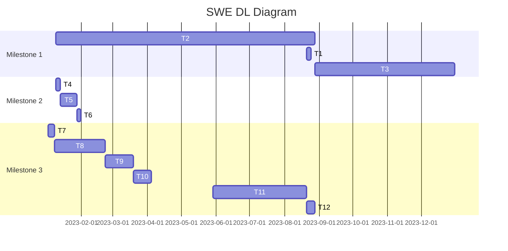
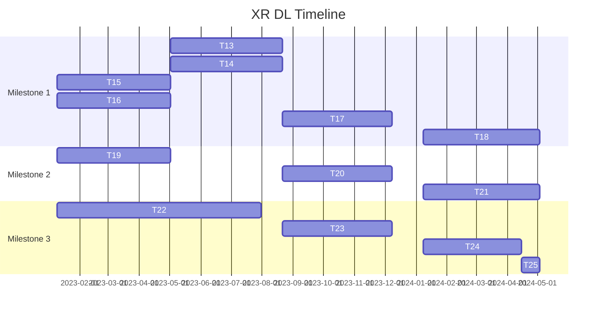

# Deliberate Learning

## Software Engineering DL

### Motivation
[MOTIVATION]

### Milestones
* [Milestone 1 - Become a Junior Engineer at FAANG+](https://github.com/timothyoei/deliberate-learning/milestone/1)
* [Milestone 2 - Build a Side Project with 1k Users](https://github.com/timothyoei/deliberate-learning/milestone/2)
* [Milestone 3 - Contribute to Open Source](https://github.com/timothyoei/deliberate-learning/milestone/3)

### Roadmap

## Extended Reality DL

### Motivation
[MOTIVATION]

### Milestones
* [Milestone 1 - Master Foundational Material](https://github.com/timothyoei/deliberate-learning/milestone/4)
* [Milestone 2 - Complete UCF Mixed Reality Engineering Certificate](https://github.com/timothyoei/deliberate-learning/milestone/5)
* [Milestone 3 - Conduct Research for UCF HUT](https://github.com/timothyoei/deliberate-learning/milestone/6)

### Roadmap

## Next Steps
